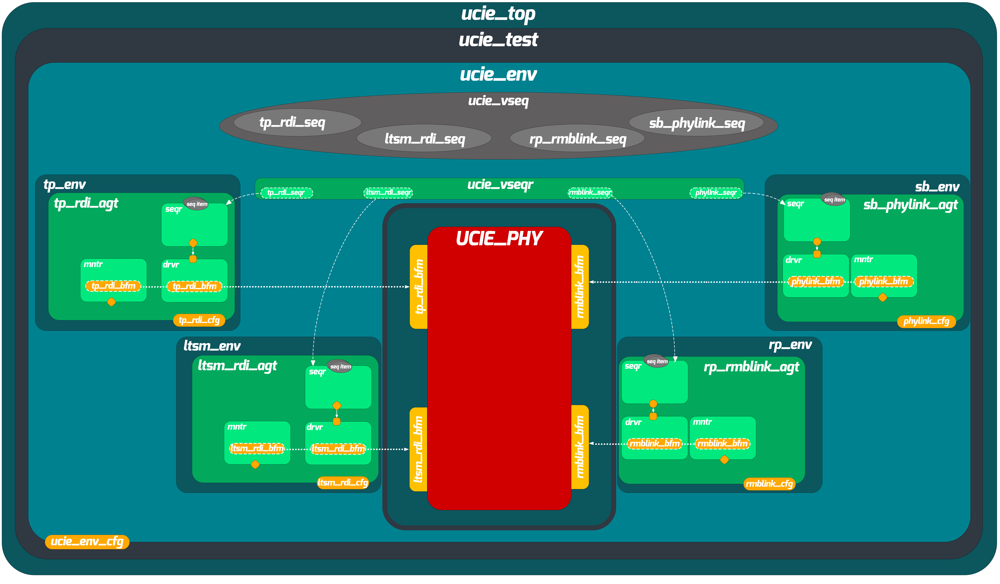
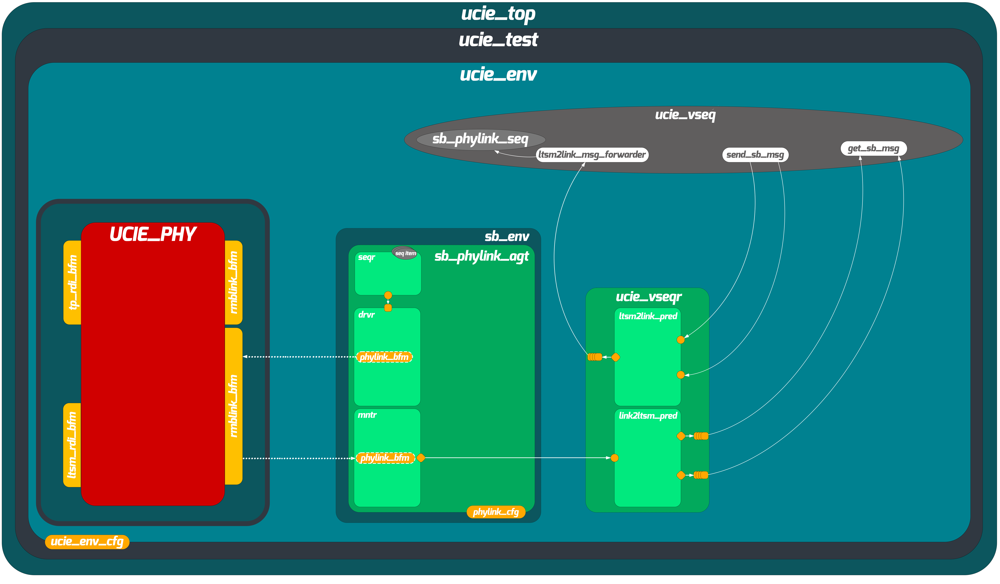

# UCIe PHY System-Level UVM Verification Environment

## Overview

The UCIe (Universal Chiplet Interconnect Express) PHY is the physical layer responsible for high-speed die-to-die communication in chiplet-based systems. Before two dies can exchange user data, the PHY must go through a multi-phase bring-up process:

1. **Sideband Initialization**: A low-speed serial handshake between the two dies to confirm the physical link is alive.
2. **Mainband Initialization**: Configuration and calibration of the high-speed data lanes (clock alignment, lane reversal, repair).
3. **Mainband Training**: Fine-tuning of receiver parameters (voltage reference, deskew, timing centering) across multiple training states.
4. **Active Data Transfer**: Once training completes, the link enters active mode and streams high-speed data.

The system-level verification environment validates the entire PHY bring-up flow by composing the four block-level UVM environments into a single unified testbench. Instead of writing new verification infrastructure from scratch, this environment reuses the existing block-level agents, monitors, scoreboards, and predictors — reconfiguring them to work together at the system level.

---

## Environment Architecture

The system-level environment instantiates four block-level sub-environments, each with its agents selectively configured as active or passive depending on the system-level stimulus strategy.



The four sub-environments are:

| Sub-Environment | Package | Role at System Level |
|---|---|---|
| LTSM Environment | `LTSM_pkg` | RDI agent active; all others passive |
| Sideband Environment | `sb_pkg` | Physical link agent active; all others passive |
| RX-Path Environment | `rp_pkg` | Reverse mainband link agent active; all others passive |
| TX-Path Environment | `tx_tb_pkg` | RDI agent active; all others passive |

In each sub-environment, only the agents that drive stimulus into the DUT are set to `UVM_ACTIVE`. The remaining agents operate in `UVM_PASSIVE` mode, meaning their monitors still observe DUT outputs and feed the block-level scoreboards, but their drivers and sequencers are not instantiated.

---

## Virtual Sequencer and Predictor Reuse

A central design decision in this environment is the use of a custom virtual sequencer (`ucie_vseqr`) that does more than just hold sequencer handles. It also instantiates the Sideband block-level predictors to model the behavior of the remote die.



The virtual sequencer contains:

- **Child sequencer handles**: `ltsm_rdi_seqr`, `sb_phylink_seqr`, `rp_rmblink_seqr`, `tx_rdi_seqr` — one for each active agent across the four sub-environments.
- **Sideband predictors**: `prd_link2ltsm` and `prd_ltsm2link` — the same predictor classes used in the Sideband block-level scoreboard, reused here to convert between high-level message encodings and serialized physical link transactions.
- **TLM FIFOs**: `tx_fifo`, `rx_fifo`, and `link_fifo` — used to pass transactions between the predictors and the virtual sequences.

This means the virtual sequences can work at a high abstraction level: they write a message encoding to the predictor, and the predictor converts it into a serialized physical link transaction that gets forwarded through `link_fifo` to the Sideband physical link driver. Similarly, when the DUT sends a message, the monitor captures it, the predictor deserializes it, and the result appears in `tx_fifo` or `rx_fifo` for the sequence to consume.

The base virtual sequence (`ucie_vseq_base`) starts a background `fork-join_none` thread in `pre_body()` that continuously reads from `link_fifo` and drives the serialized items onto the physical link sequencer. This keeps the serialization transparent to all derived sequences.

---

## Directory Structure

```
UCIE_top_env/
├── doc/                                    # Documentation and architecture diagrams
│   ├── UCIE_PHY_UVM_Structure.png
│   └── UCIE_vseqr.png
├── sim/                                    # Simulation scripts and coverage data
│   ├── Makefile
│   ├── compile.do
│   ├── run.do
│   ├── runsys.do
│   ├── coverage.do
│   ├── apply_cov_exclusions.do
│   ├── apply_exclusions.do
│   └── waves.do
└── src/
    ├── env/                                # Environment and configuration
    │   ├── ucie_env.sv                     #   System-level environment
    │   └── ucie_env_cfg.sv                 #   Configuration (holds sub-env configs)
    ├── tb/                                 # Testbench top and package
    │   ├── ucie_tb_top.sv                  #   Top module (DUT instantiation, interface binding)
    │   └── ucie_pkg.sv                     #   Package (imports all sub-env packages)
    ├── seq_lib/                            # Virtual sequences
    │   ├── ucie_vseqr.sv                   #   Virtual sequencer (with predictor instances)
    │   ├── ucie_vseq_base.sv               #   Base virtual sequence
    │   ├── ucie_sbinit_vseq.sv             #   Sideband initialization sequence
    │   ├── ucie_mbinit_bringup_vseq.sv     #   Mainband initialization bringup
    │   ├── ucie_mbinit_fail_vseq.sv        #   Mainband initialization failure injection
    │   ├── ucie_mbinit_fail_all_vseq.sv    #   All mainband init failure scenarios
    │   ├── ucie_mbtrain_vseq.sv            #   Full mainband training sequence
    │   ├── ucie_mbtrain_till_*.sv          #   Partial training (up to specific states)
    │   ├── ucie_trainerror_vseq.sv         #   Train error handling sequence
    │   ├── ucie_vvref_till_rxcal_vseq.sv   #   Voltage ref through RX calibration
    │   ├── ucie_sbinit_virtual_sequences/  #   SBINIT bringup sub-sequences
    │   │   ├── ucie_sbinit_bringup_vseq.sv
    │   │   ├── ucie_sbinit_bringup_tx_vseq.sv
    │   │   └── ucie_sbinit_bringup_rx_vseq.sv
    │   ├── ucie_mbtrain_states/            #   Per-state training sub-sequences
    │   │   ├── ucie_mbtrain_speedidle_vseq.sv
    │   │   ├── ucie_mbtrain_txselfcal_vseq.sv
    │   │   ├── ucie_mbtrain_rxclkcal_vseq.sv
    │   │   ├── ucie_mbtrain_valtraincenter_vseq.sv
    │   │   ├── ucie_mbtrain_valtrainverf_vseq.sv
    │   │   ├── ucie_mbtrain_DTC1_vseq.sv
    │   │   ├── ucie_mbtrain_datatrainvref_vseq.sv
    │   │   ├── ucie_mbtrain_rxdskew_vseq.sv
    │   │   ├── ucie_mbtrain_DTC2_vseq.sv
    │   │   ├── ucie_mbtrain_linkspeed_vseq.sv
    │   │   ├── ucie_mbtrain_repair_vseq.sv
    │   │   ├── ucie_mbtrain_valverf_vseq.sv
    │   │   ├── ucie_mbtrain_dataverf_vseq.sv
    │   │   ├── ucie_RX_D2C_vseq.sv
    │   │   └── ucie_TX_D2c_vseq.sv
    │   └── sb_sequences/                   #   Sideband physical link sequences
    │       └── active_phylink_sequence.sv
    └── tests/                              # UVM tests
        ├── ucie_base_test.sv               #   Base test class
        ├── ucie_sanity_test.sv             #   Full bring-up sanity test
        ├── ucie_sbinit_test.sv             #   Sideband init only
        ├── ucie_mbtrain_linkspeed_test.sv  #   Link speed training test
        ├── ucie_mbtrain_from_valtraincenter_to_DTC2_test.sv
        ├── ucie_vvref_till_rxcal_vseq_test.sv
        ├── ucie_mbinit_fail_test.sv        #   MBINIT failure injection
        ├── ucie_mbinit_fail_all_test.sv    #   All MBINIT failure scenarios
        ├── ucie_mbinit_fail_clk_test.sv    #   Clock-specific failure
        ├── ucie_mbinit_fail_val_test.sv    #   Validation-specific failure
        ├── ucie_mbinit_fail_reversal_test.sv   # Lane reversal failure
        ├── ucie_mbinit_fail_repair_rx_test.sv  # RX repair failure
        └── ucie_mbinit_fail_repair_tx_test.sv  # TX repair failure
```

---

## Sub-Environment Configuration

The system-level environment configures each sub-environment by setting its agent activity modes before instantiation. This is handled in the `build_phase` of `ucie_env`:

| Sub-Environment | Active Agent(s) | Passive Agent(s) |
|---|---|---|
| LTSM | `rdi_agent` | `tx_fsm_sb_agent`, `rx_fsm_sb_agent`, `LTSM_controllers_agent` |
| Sideband | `phylink_agent` | `ltsm_ctrl_agent`, `tx_agent`, `rx_agent`, `rdi_agent` |
| RX-Path | `rmblink_agent` | `rdi_agent`, `ltsmc_agent` |
| TX-Path | `rdi_agent` | `ltsm_agent` |

Each sub-environment's scoreboard continues to operate at the system level, providing block-level checking even during system-level test execution.

---

## Base Virtual Sequence

All system-level virtual sequences extend `ucie_vseq_base`, which provides:

- **Sequencer handle retrieval**: Automatically copies child sequencer handles from the virtual sequencer in `pre_body()`.
- **Sub-sequence creation**: Instantiates all block-level and training-state sub-sequences via the UVM factory, enabling factory overrides.
- **Sideband message API**: The `send_sb_msg()` function allows sequences to send a Sideband message by simply providing a message encoding. The function routes the encoding to the appropriate predictor, which converts it to a serialized physical link transaction.
- **Background serialization thread**: A `fork-join_none` thread in `pre_body()` continuously reads from `link_fifo` and drives the serialized items onto the physical link, keeping the serialization transparent to derived sequences.
- **Post-body synchronization**: The `post_body()` task waits for any in-progress message serialization to complete before ending the sequence.

---

## Test Descriptions

| Test | Description |
|---|---|
| `ucie_sanity_test` | Full PHY bring-up: Sideband init, mainband init, mainband training through all states, and active data transfer. |
| `ucie_sbinit_test` | Sideband initialization only, verifying the low-speed handshake completes successfully. |
| `ucie_mbtrain_linkspeed_test` | Exercises the link speed negotiation training state. |
| `ucie_mbtrain_from_valtraincenter_to_DTC2_test` | Partial training from the validation train center state through DTC2. |
| `ucie_vvref_till_rxcal_vseq_test` | Partial training from voltage reference through RX calibration. |
| `ucie_mbinit_fail_test` | Injects a failure during mainband initialization and verifies the DUT handles the error correctly. |
| `ucie_mbinit_fail_all_test` | Iterates through all possible MBINIT failure points (parameter, calibration, clock, validation, reversal, repair). |
| `ucie_mbinit_fail_clk_test` | Targets clock-specific failures during MBINIT. |
| `ucie_mbinit_fail_val_test` | Targets validation-specific failures during MBINIT. |
| `ucie_mbinit_fail_reversal_test` | Targets lane reversal failures during MBINIT. |
| `ucie_mbinit_fail_repair_rx_test` | Targets RX repair failures during MBINIT. |
| `ucie_mbinit_fail_repair_tx_test` | Targets TX repair failures during MBINIT. |

---

## Reset Testing

The base test class (`ucie_base_test`) monitors the reset signal during `main_phase`. When a reset is detected mid-operation, the test jumps back to `uvm_pre_reset_phase`, triggering all sub-environments and the virtual sequencer to flush their internal state (TLM FIFOs, sequence handles) and restart cleanly. This verifies that the entire PHY — across all four sub-environments — can recover from a reset and re-initialize correctly.

---

## Coverage

Each sub-environment's coverage collector continues to operate at the system level. The combined coverage across all 12 system-level tests achieved 100% functional coverage and 100% code coverage.
