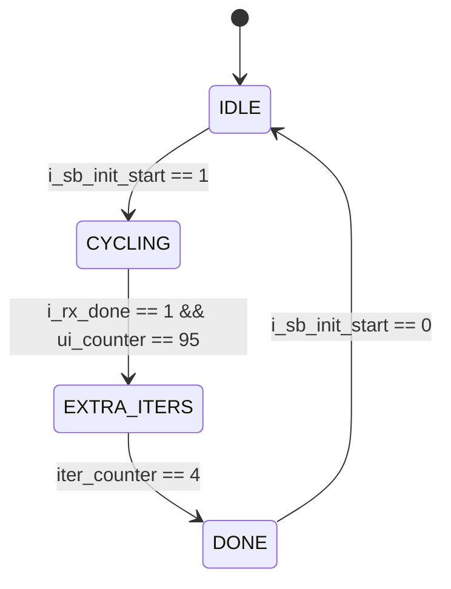
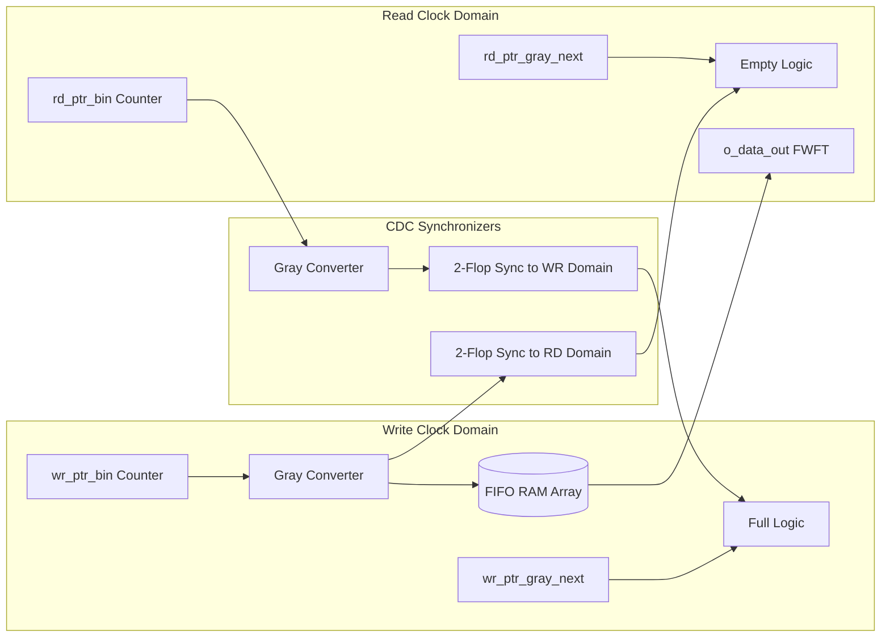

# Rigorous Thesis Specification: Universal Chiplet Interconnect Express (UCIe) Sideband Design

This document serves as a comprehensive, highly detailed technical thesis specification of the implemented UCIe Sideband (SB) controller. It describes the clocking architecture, link initialization procedures, clock domain crossing (CDC) techniques, serial/deserialization logic, traffic manager scheduling, packet formatting, and parity protection.

All equations, state machines, bit-level fields, and module interactions are documented with academic rigor to facilitate immediate translation into a LaTeX thesis layout.

---

## 1. Introduction and Architectural Overview

The Universal Chiplet Interconnect Express (UCIe) Sideband (SB) is a dedicated physical-layer control interface operating in parallel with the high-bandwidth Mainband (MB). While the Mainband transfers high-speed data, the Sideband is responsible for link initialization, training, calibration, power management, error reporting, and register access.

### 1.1 Interface Parameters and Fabric Clock Domains
The controller coordinates operations across three distinct clock domains:
1. **Fabric System Clock ($f_{\text{fabric}} \approx 100 \text{ MHz}$)**: Driven by `i_clk`. Most of the control logic, traffic scheduling, and message encoding/decoding wrappers reside in this domain.
2. **SerDes Line Clock ($f_{\text{line}} = 800 \text{ MHz}$)**: Driven by `i_800MHz_clk`. This is a high-speed clock used for parallel-to-serial conversion on the transmit side.
3. **Source-Synchronous Receive Clock (`i_rx_sb_clk`)**: An intermittent clock forwarded from the remote transmitter along with the incoming data. Deserialization is executed strictly on this clock to maintain timing alignment.

### 1.2 Architectural Parameters
The design is highly parameterized to adjust to various chiplet topologies. The parameter set includes:

| Parameter | Type | Default Value | Description |
| :--- | :--- | :--- | :--- |
| `pMSG_WIDTH` | Integer | 128 | Standard sideband packet width in bits |
| `pDESER_WIDTH` | Integer | 64 | Parallel interface width of the Deserializer |
| `pSER_WIDTH` | Integer | 64 | Parallel interface width of the Serializer |
| `pFIFO_WIDTH` | Integer | 128 | Data width for the CDC FIFOs |
| `pFIFO_DEPTH` | Integer | 32 | Depth of the dual-clock CDC queues (must be $2^N$) |
| `pENCODING_WIDTH`| Integer | 9 | Bit width of fabric-level transmit message selectors |
| `pDECODING_WIDTH`| Integer | 9 | Bit width of fabric-level receive message decoders |
| `pDATA_WIDTH` | Integer | 64 | Length of register data payload |
| `pINFO_WIDTH` | Integer | 16 | Width of the packet information field |
| `pMSG_CODE_WIDTH`| Integer | 8 | Width of the high-level message code field |
| `pMSG_SUBCODE_WIDTH`| Integer| 8 | Width of the message subcode field |
| `pOP_CODE_WIDTH` | Integer | 5 | Width of the packet opcode field |
| `pRESERVED` | Bit | `1'b0` | Reserved field placeholder |

---

## 2. Top-Level Integration (`ucie_sb_top`)

The top-level module `ucie_sb_top` acts as the coordinator of the Sideband Controller. It instantiates the Initialization FSMs, Egress/Ingress data paths, Traffic scheduler, and Fabric wrappers.

```mermaid
graph TD
    i_clk([i_clk]) --> u_sb_tx_init
    i_clk --> u_sideband_out
    i_clk --> u_sb_traffic
    i_clk --> u_tx_msg
    i_clk --> u_rx_msg

    i_800MHz_clk([i_800MHz_clk]) --> u_sb_tx_init
    i_800MHz_clk --> u_sideband_out
    i_800MHz_clk --> u_sideband_in

    i_rx_sb_clk([i_rx_sb_clk]) --> u_sb_rx_clk_demux
    i_rx_sb_data([i_rx_sb_data]) --> u_sb_rx_data_demux

    subgraph Muxing & Demuxing
        u_sb_tx_clk_mux[ucie_sideband_mux: Clock Mux]
        u_sb_tx_data_mux[ucie_sideband_mux: Data Mux]
        u_sb_rx_clk_demux[ucie_sideband_demux: Clock Demux]
        u_sb_rx_data_demux[ucie_sideband_demux: Data Demux]
    end

    subgraph Initialization Blocks
        u_sb_tx_init[ucie_sb_tx_path: TX Initialization]
        u_sb_rx_init[ucie_sb_rx_path: RX Initialization]
    end

    subgraph Active Data Path
        u_sideband_out[ucie_sideband_out: TX Egress]
        u_sideband_in[ucie_sideband_in: RX Ingress]
        u_sb_traffic[ucie_sb_traffic: Traffic Manager]
    end

    subgraph Fabric Message Interface
        u_tx_msg[ucie_sideband_tx_msg: TX Message Wrapper]
        u_rx_msg[ucie_sideband_rx_msg: RX Message Wrapper]
    end

    i_sb_init_start([i_sb_init_start]) --> u_sb_tx_clk_mux
    i_sb_init_start --> u_sb_tx_data_mux
    i_sb_init_start --> u_sb_rx_clk_demux
    i_sb_init_start --> u_sb_rx_data_demux
```



### 2.1 Mode Multiplexing and Demultiplexing
To switch between the **Initialization Mode** (link training) and the **Active Mode** (packet transmission), the physical pins are routed dynamically via `ucie_sideband_mux` and `ucie_sideband_demux` blocks, controlled by `i_sb_init_start`:

* **Transmit Paths (Multiplexers)**:
  $$\text{o\_tx\_sb\_clk} = \begin{cases} \text{sb\_init\_tx\_clk} & \text{if } i\_sb\_init\_start = 1 \\ \text{sb\_tx\_clk} & \text{if } i\_sb\_init\_start = 0 \end{cases}$$
  $$\text{o\_tx\_sb\_data} = \begin{cases} \text{sb\_init\_tx\_data} & \text{if } i\_sb\_init\_start = 1 \\ \text{sb\_tx\_data} & \text{if } i\_sb\_init\_start = 0 \end{cases}$$

* **Receive Paths (Demultiplexers)**:
  $$\text{sb\_init\_rx\_clk} = \begin{cases} i\_rx\_sb\_clk & \text{if } i\_sb\_init\_start = 1 \\ 0 & \text{if } i\_sb\_init\_start = 0 \end{cases}$$
  $$\text{sb\_rx\_clk} = \begin{cases} 0 & \text{if } i\_sb\_init\_start = 1 \\ i\_rx\_sb\_clk & \text{if } i\_sb\_init\_start = 0 \end{cases}$$
  $$\text{sb\_init\_rx\_data} = \begin{cases} i\_rx\_sb\_data & \text{if } i\_sb\_init\_start = 1 \\ 0 & \text{if } i\_sb\_init\_start = 0 \end{cases}$$
  $$\text{sb\_rx\_data} = \begin{cases} 0 & \text{if } i\_sb\_init\_start = 1 \\ i\_rx\_sb\_data & \text{if } i\_sb\_init\_start = 0 \end{cases}$$

---

## 3. Sideband Initialization (SBINIT) Protocol

Link training aligns the physical receivers before message transmission. The initialization sequence is governed by a handshaking mechanism between the local transmitter FSM and the remote receiver detection logic.

### 3.1 Transmitter Path FSM (`ucie_sb_tx_path`)
The transmitter initialization block features a dual-clock architecture. The FSM states are synchronized to the slow `i_clk`, while the pattern generation counters and output drivers run on the fast SerDes clock `i_s_clk` (800 MHz).

The FSM transitions through four states:
1. `IDLE` ($2'\text{b00}$): The FSM is inactive, holding outputs low. Transitions to `CYCLING` when `i_sb_init_start` rises.
2. `CYCLING` ($2'\text{b01}$): Alternates 1 ms ON and 1 ms OFF training cycles. During the ON phase, it transmits a 96-UI training pattern. It transitions to `EXTRA_ITERS` when `i_rx_done` goes high, synchronizing with the completion of the current 96-UI boundary.
3. `EXTRA_ITERS` ($2'\text{b10}$): Transmits exactly 4 extra complete 96-UI training iterations to ensure receiver PLL and clock recovery stability.
4. `DONE` ($2'\text{b11}$): Asserts the initialization completion flag `o_stop = 1`. Moves back to `IDLE` when `i_sb_init_start` is deasserted.



#### 3.1.1 Pattern Generation Logic
A single 96-UI training sequence comprises:
* **First 64 UI**: Toggles clock-like data (`101010...` at SerDes speed) on both `o_tx_sb_data` and `o_tx_sb_clk`.
  $$w\_gen\_data = \sim ui\_counter[0]$$
  $$w\_gen\_clk = i\_s\_clk \land r\_clk\_en\_safe \land r\_1ms\_active$$
* **Next 32 UI**: Driven to a quiet low state.
  $$w\_gen\_data = 1'b0, \quad w\_gen\_clk = 1'b0$$

#### 3.1.2 Clock-Gating Control (`r_clk_en_safe`)
To prevent clock glitches at the boundary transitions of the 64-UI toggling burst, the clock enable signal is registered on the **negative edge** of `i_s_clk` to mask transitions during phase changes:
$$\text{At negedge } i\_s\_clk: \quad r\_clk\_en\_safe \leftarrow \begin{cases} 1'b0 & \text{if } 63 \le ui\_counter \le 65 \\ 1'b1 & \text{otherwise} \end{cases}$$

### 3.2 Receiver Path Lock Logic (`ucie_sb_rx_path`)
The receiver lock block runs on the forwarded `i_rx_sb_clk`. It verifies the presence of the training pattern.

It samples `i_rx_sb_data` on the **negative edge** of the incoming clock to maximize timing setup and hold margins. The locking logic uses a counter and a flag:
1. `pattern_cnt` (8-bit): Tracks consecutive alternating bits.
2. `r_detected_flag` (1-bit): Set to `1` when lock is achieved.

#### 3.2.1 Lock State Transitions
At each negative edge of `i_rx_sb_clk`, when `i_sb_init_start` is active:
* **Alternation Check**: If $i\_rx\_sb\_data \neq r\_prev\_data$:
  $$pattern\_cnt \leftarrow \min(pattern\_cnt + 1, 128)$$
* **Mismatch Reset**: If $i\_rx\_sb\_data = r\_prev\_data$:
  $$pattern\_cnt \leftarrow 0$$
* **Lock Condition**: If $pattern\_cnt \ge 127$:
  $$r\_detected\_flag \leftarrow 1'b1$$

The output lock signal is driven by this flag:
$$o\_done = r\_detected\_flag$$

---

## 4. Clock Domain Crossing (CDC) and Buffering

Since the fabric logic ($f_{\text{fabric}} \approx 100 \text{ MHz}$) and physical lines ($f_{\text{line}} = 800 \text{ MHz}$) run on asynchronous clock domains, dual-clock FIFO structures are used to prevent metastability.

### 4.1 Asynchronous FIFO (`ucie_sideband_fifo`)
The FIFO handles data routing between the write domain (`i_clk_wr`) and the read domain (`i_clk_rd`). Pointer synchronization uses a binary-to-Gray code conversion scheme to ensure only one bit changes per transition.



#### 4.1.1 Gray Code Pointer Conversion
Let $B = [b_N, b_{N-1}, \dots, b_0]$ represent the binary pointer, and $G = [g_N, g_{N-1}, \dots, g_0]$ represent the corresponding Gray code pointer. The conversion is defined by:
$$g_i = b_i \oplus b_{i+1} \quad (0 \le i < N), \quad g_N = b_N$$
$$G = B \oplus (B \gg 1)$$

In SystemVerilog:
```systemverilog
assign wr_ptr_gray_next = wr_ptr_bin_next ^ (wr_ptr_bin_next >> 1);
assign rd_ptr_gray_next = rd_ptr_bin_next ^ (rd_ptr_bin_next >> 1);
```

#### 4.1.2 Two-Stage Sync Registers
Gray pointers are transferred across the clock boundary through a 2-stage synchronizer chain:
* **Sync Read Pointer into Write Domain**:
  $$rd\_ptr\_gray\_sync1 \leftarrow rd\_ptr\_gray$$
  $$rd\_ptr\_gray\_sync2 \leftarrow rd\_ptr\_gray\_sync1$$
* **Sync Write Pointer into Read Domain**:
  $$wr\_ptr\_gray\_sync1 \leftarrow wr\_ptr\_gray$$
  $$wr\_ptr\_gray\_sync2 \leftarrow wr\_ptr\_gray\_sync1$$

#### 4.1.3 Full and Empty Flag Calculations
The status flags are generated in their respective clock domains to avoid routing delays:
* **Full Condition (Write Domain)**: Driven by the next write pointer state compared with the synchronized read pointer. The write pointer wraps, so the two most significant bits of the Gray code are inverted:
  $$full\_val = (wr\_ptr\_gray\_next == \{\sim rd\_ptr\_gray\_sync2[AW:AW-1], rd\_ptr\_gray\_sync2[AW-2:0]\})$$
* **Empty Condition (Read Domain)**: Evaluated directly when the next read pointer matches the synchronized write pointer:
  $$empty\_val = (rd\_ptr\_gray\_next == wr\_ptr\_gray\_sync2)$$

### 4.2 Single-Clock FWFT FIFO (`ucie_sideband_fifo_FWFT`)
For buffering within a single clock domain (e.g., fabric request queues), the design uses `ucie_sideband_fifo_FWFT`. It calculates depth status directly:
$$\text{count} = wr\_count - rd\_count$$
$$o\_full = (\text{count} == \text{pFIFO\_DEPTH})$$
$$o\_empty = (\text{count} == 0)$$

The First-Word Fall-Through (FWFT) feature bypasses read clock latency by mapping the memory output combinationally:
$$o\_data\_out = fifo\_mem[rd\_ptr]$$

---

## 5. Serializer and Deserializer Pipelines

To minimize physical pin count, parallel data buses are serialized for transmission and deserialized on reception.

```
Transmitter Path:
[128-bit Message] 
       │ (ucie_sideband_traffic_fifo)
       ▼
 [2x 64-bit segments (Endian Swapped)]
       │ (ucie_sideband_fifo: CDC FIFO)
       ▼
 [64-bit Egress segments]
       │ (ucie_sideband_ser: FSM)
       ▼
 [Serial Stream @ 800MHz] ────► Physical Pins (o_tx_sb_clk, o_tx_sb_data)

Receiver Path:
 Physical Pins (i_rx_sb_clk, i_rx_sb_data)
       │ (ucie_sideband_deser: sampled on Negedge)
       ▼
 [64-bit Ingress segments]
       │ (ucie_sideband_fifo: CDC FIFO)
       ▼
 [64-bit Ingress segments]
       │ (ucie_sideband_fifo_traffic: Assembly)
       ▼
[128-bit Reconstructed Message]
```

### 5.1 Serializer Engine (`ucie_sideband_ser`)
The serializer block converts a 64-bit word into a serial stream at 800 MHz. The control path is managed by a 3-state FSM:

1. `ST_IDLE` ($2'\text{b00}$): Remains here until `i_fifo_empty` goes low.
2. `ST_LOW` ($2'\text{b01}$): Inserts a 32-UI quiet low gap before the packet starts. A counter (`bit_counter`) tracks this phase:
   $$\text{If } bit\_counter = 31: \quad o\_fifo\_rd\_en \leftarrow 1'b1, \quad next\_state \leftarrow ST\_TX$$
3. `ST_TX` ($2'\text{b10}$): Transmits data over 64 clock cycles. The shift register shifts right, driving bit 0 onto the serial pin:
   $$\text{Each } posedge\ i\_clk: \quad shift\_reg \leftarrow \{1'b0, shift\_reg[63:1]\}$$
   $$o\_tx\_sb\_data = shift\_reg[0]$$
   $$\text{If } bit\_counter = 63: \quad next\_state \leftarrow \begin{cases} ST\_LOW & \text{if } i\_fifo\_empty = 0 \\ ST\_IDLE & \text{if } i\_fifo\_empty = 1 \end{cases}$$

#### 5.1.1 Glitch-Free Lookahead Clock Gating
The source-synchronous clock `o_tx_sb_clk` is driven only during data transmission. To prevent glitches, the enable signal is registered on the **negative edge** of `i_clk`:
$$\text{At negedge } i\_clk: \quad clk\_en\_ff \leftarrow (next\_state == ST\_TX)$$
$$o\_tx\_sb\_clk = clk\_en\_ff \land i\_clk$$

### 5.2 Deserializer Engine (`ucie_sideband_deser`)
The deserializer captures serial data `i_rx_sb_data` on the **negative edge** of the incoming `i_rx_sb_clk` to guarantee timing alignment.

#### 5.2.1 Shift and Transfer Mechanics
The serial bitstream is shifted in from the MSB side:
$$\text{At negedge } i\_rx\_sb\_clk: \quad shift\_reg \leftarrow \{i\_rx\_sb\_data, shift\_reg[63:1]\}$$

When `bit_counter` reaches 63, the deserialized word is transferred to the output buffer, and the toggle flag alternates:
$$o\_fifo\_deser\_msg \leftarrow \{i\_rx\_sb\_data, shift\_reg[63:1]\}$$
$$data\_rdy\_toggle \leftarrow \sim data\_rdy\_toggle$$

#### 5.2.2 Asynchronous Write Pulse Generation
To write data into the CDC FIFO, the toggle signal `data_rdy_toggle` is synchronized to the local `i_800MHz_clk` domain using a 3-stage register chain:
$$sync1\_800mhz \leftarrow data\_rdy\_toggle$$
$$sync2\_800mhz \leftarrow sync1\_800mhz$$
$$sync3\_800mhz \leftarrow sync2\_800mhz$$

An edge detector generates a write pulse:
$$write\_pulse = sync2\_800mhz \oplus sync3\_800mhz$$
$$o\_fifo\_wr\_en = write\_pulse \land (\sim i\_fifo\_full)$$

---

## 6. Message Segmenting and Reassembly

Because the SerDes interface has a 64-bit data path, 128-bit fabric messages must be segmented at transmission and reassembled upon reception.

### 6.1 Transmitter Segmenter (`ucie_sideband_traffic_fifo`)
This module splits the 128-bit input packet `i_sb_msg` into two 64-bit segments. It also swaps the 32-bit halves of each segment to match the line's endianness.

The state machine includes four states:
* `ST_IDLE`: Checks if a packet is ready. If `!i_fifo_full`, it formats and writes the first segment (containing the control header):
  $$o\_traffic\_ser\_fifo \leftarrow \{i\_sb\_msg[95:64], i\_sb\_msg[127:96]\}$$
  It sets `o_stall_traffic = 1'b1`, `o_fifo_wr_en = 1'b1`, and moves to `ST_WR_MSG`.
* `ST_WR_MSG`: Checks the packet opcode field $i\_sb\_msg[100:96]$:
  * **Opcode `5'b10010` (No Payload)**: The transfer is complete; FSM returns to `ST_IDLE`.
  * **Opcode `5'b11011` (With Payload)**: Writes the second segment (the data payload):
    $$o\_traffic\_ser\_fifo \leftarrow \{i\_sb\_msg[31:0], i\_sb\_msg[63:32]\}$$
    It sets `o_stall_traffic = 1'b1`, `o_fifo_wr_en = 1'b1`, and moves to `ST_DATA_MSG`. If the FIFO is full, it sets `con_full = 1'b1` and enters `ST_WAIT_FULL`.
* `ST_DATA_MSG`: Completes the transfer and returns to `ST_IDLE`.
* `ST_WAIT_FULL`: Stalls until `i_fifo_full` goes low. It then writes the pending segment (`con_full` determines if it writes the header or the payload) and updates the state.

### 6.2 Receiver Assembler (`ucie_sideband_fifo_traffic`)
This module reconstructs the 128-bit packet from the 64-bit segments popped from the CDC FIFO.

The state machine transitions as follows:
* `ST_IDLE`: Checks if data is available (`!i_fifo_empty`). It reads the first segment and maps the control header:
  $$o\_sb\_msg[127:64] \leftarrow \{i\_traffic\_deser\_fifo[31:0], i\_traffic\_deser\_fifo[63:32]\}$$
  It pops the FIFO (`o_fifo_rd_en = 1'b1`) and checks the opcode from the segment's bits [4:0] (corresponding to $i\_sb\_msg[100:96]$):
  * **Opcode `5'b10010` (No Payload)**: Asserts `o_traffic_ready = 1'b1` and moves to `ST_WAIT_NX`.
  * **Opcode `5'b11011` (With Payload)**: Moves to `ST_WAIT_M2` to wait for the next FIFO update.
* `ST_WAIT_M2`: Waits one clock cycle for the FIFO to register the second segment, then transitions to `ST_CAP_M2`.
* `ST_CAP_M2`: Reads the second segment and maps the payload:
  $$o\_sb\_msg[63:0] \leftarrow \{i\_traffic\_deser\_fifo[63:32], i\_traffic\_deser\_fifo[31:0]\}$$
  It sets `o_fifo_rd_en = 1'b1`, asserts `o_traffic_ready = 1'b1`, and moves to `ST_WAIT_NX`.
* `ST_WAIT_NX`: Returns to `ST_IDLE` on the next cycle.

---

## 7. Sideband Traffic Manager (`ucie_sb_traffic`)

The traffic manager acts as the central router and arbiter, dispatching packets between the fabric interfaces and the physical link.

```
       ┌────────────────────────┐
       │   tx_traffic_fifo      │ (Fabric TX Egress Requests)
       └───────────┬────────────┘
                   │
                   ▼
     Ping-Pong Round-Robin Arbiter (tx_rd_first) ──► o_sb_msg_out (To Serializer)
                   ▲
                   │
       ┌───────────┴────────────┐
       │   rx_traffic_fifo      │ (Fabric RX Egress Responses)
       └────────────────────────┘
```

### 7.1 Ping-Pong Round-Robin Scheduling
To prevent queue starvation, the scheduler alternates reads between the transmit queue (`tx_traffic_fifo`) and the receive queue (`rx_traffic_fifo`) when both contain packets. This is controlled by the `tx_rd_first` flag:

$$\text{Next Read Source} = \begin{cases}
  \text{tx\_traffic\_fifo} & \text{if } !i\_tx\_traffic\_fifo\_empty \land i\_rx\_traffic\_fifo\_empty \\
  \text{rx\_traffic\_fifo} & \text{if } i\_tx\_traffic\_fifo\_empty \land !i\_rx\_traffic\_fifo\_empty \\
  \text{Alternate} & \text{if } !i\_tx\_traffic\_fifo\_empty \land !i\_rx\_traffic\_fifo\_empty \text{ (based on } tx\_rd\_first\text{)}
\end{cases}$$

When both queues are active, the scheduling logic executes the following sequence:
* **State 1 ($tx\_rd\_first = 0$)**:
  $$o\_sb\_msg\_out \leftarrow i\_tx\_traffic\_fifo\_msg, \quad o\_tx\_traffic\_fifo\_rd\_en \leftarrow 1'b1, \quad tx\_rd\_first \leftarrow 1'b1$$
* **State 2 ($tx\_rd\_first = 1$)**:
  $$o\_sb\_msg\_out \leftarrow i\_rx\_traffic\_fifo\_msg, \quad o\_rx\_traffic\_fifo\_rd\_en \leftarrow 1'b1, \quad tx\_rd\_first \leftarrow 1'b0$$

### 7.2 Message Routing Logic
Inbound messages from the deserializer (`i_sb_msg_in`) are routed based on their source, destination, and command codes:

* **Egress Response Queue (`o_traffic_tx_fifo`)**: Captured if $srcid = 3'\text{b010}$, $dstid = 3'\text{b110}$, and the command matches one of the following criteria:
  * Response codes: $msg\_code[3:0] = 4'\text{hA}$ (excluding specific sweeps).
  * Direct matches: $\{msg\_code, msg\_subcode\}$ is $\{8'\text{h85}, 8'\text{h0A}\}$, $\{8'\text{h85}, 8'\text{h0D}\}$, or $\{8'\text{h02}, 8'\text{h01}\}$.
* **Egress Request Queue (`o_traffic_rx_fifo`)**: Captured if $srcid = 3'\text{b010}$, $dstid = 3'\text{b110}$, and the command matches one of the following criteria:
  * Request codes: $msg\_code[3:0] = 4'\text{h5}$ (excluding specific sweeps).
  * Direct matches: $\{msg\_code, msg\_subcode\}$ is $\{8'\text{h8A}, 8'\text{h0A}\}$, $\{8'\text{h91}, 8'\text{h00}\}$, $\{8'\text{h81}, 8'\text{h0C}\}$, $\{8'\text{h8A}, 8'\text{h0D}\}$, or $\{8'\text{h01}, 8'\text{h01}\}$.

### 7.3 Backpressure Flow Control
If a routed packet is ready (`i_traffic_msg_ready = 1'b1`) but the destination queue is full, the traffic manager asserts the stall signal to halt upstream data generation:
$$o\_stall\_traffic = \begin{cases} 1'b1 & \text{if } (i\_traffic\_tx\_fifo\_full \lor i\_traffic\_rx\_fifo\_full) \land i\_traffic\_msg\_ready \\ 1'b0 & \text{otherwise} \end{cases}$$

---

## 8. Packet Framing, Encoding, and Parity Protection

### 8.1 128-bit Packet Format
Sideband messages are framed into a 128-bit structure, mapped as follows:

```
 127      125 124 118 117      110 109   101 100    96 95 94 93      91 90     88 87      72 71      64 63       0
┌────────────┬───────┬────────────┬─────────┬─────────┬──┬──┬──────────┬──────────┬──────────┬──────────┬─────────┐
│   srcid    │ Rsvd  │  msg_code  │  Rsvd   │ op_code │DP│CP│   Rsvd   │  dstid   │ info_in  │msg_subcod│  data   │
└────────────┴───────┴────────────┴─────────┴─────────┴──┴──┴──────────┴──────────┴──────────┴──────────┴─────────┘
```

| Bit Field | Name | Width | Description |
| :--- | :--- | :---: | :--- |
| `[127:125]` | `srcid` | 3 | Source identifier ($3'\text{b010}$ for local Physical Layer) |
| `[124:118]` | Reserved | 7 | Reserved space, driven to zero |
| `[117:110]` | `msg_code` | 8 | Command category identifier |
| `[109:101]` | Reserved | 9 | Reserved space, driven to zero |
| `[100:96]` | `op_code` | 5 | Opcode ($5'\text{b11011}$ with payload, $5'\text{b10010}$ without) |
| `[95]` | `dp` | 1 | Data Parity bit (even parity over data field) |
| `[94]` | `cp` | 1 | Control Parity bit (even parity over header fields) |
| `[93:91]` | Reserved | 3 | Reserved space, driven to zero |
| `[90:88]` | `dstid` | 3 | Destination identifier ($3'\text{b110}$ for remote Physical Layer) |
| `[87:72]` | `info_in` | 16 | Parameter or address information field |
| `[71:64]` | `msg_subcode` | 8 | Specific action command sub-code |
| `[63:0]` | `data_in` | 64 | Packet data payload |

### 8.2 Parity Protection Equations
To prevent command execution from corrupt packets, the receiver checks parity bit logic combinationally:

* **Control Parity ($CP$)**: Even parity computed over the header fields:
  $$CP = \bigoplus \big( msg\_in[127:96] \,||\, msg\_in[93:64] \big)$$
* **Data Parity ($DP$)**: Even parity computed over the data payload:
  $$DP = \bigoplus msg\_in[63:0]$$

The validation flag `dec_valid` is driven by the comparison of computed parity bits against the packet fields:
$$dec\_valid = (CP == msg\_in[94]) \land (DP == msg\_in[95]) \land (\sim invalid\_dec)$$

---

## 9. Message Encoding and Decoding Mappings

The encoder/decoder wrappers (`ucie_sideband_tx_msg` and `ucie_sideband_rx_msg`) map fabric command selectors to the formatted packet headers.

### 9.1 Core Initialization and Training Messages
The table below summarizes the key command mappings:

| Message Group | Command Code (`msg_code`) | Sub-code (`subcode`) | Opcode (`op_code`) | Type | Selectors / Enums |
| :--- | :---: | :---: | :---: | :---: | :--- |
| **SBINIT** | $8'\text{h91}$ | $8'\text{h00}$ | $5'\text{b10010}$ | Request | `SBINIT_OUT_OF_RESET` |
| | $8'\text{h95}$ | $8'\text{h01}$ | $5'\text{b10010}$ | Request | `SBINIT_DONE_REQ` |
| | $8'\text{h9A}$ | $8'\text{h01}$ | $5'\text{b10010}$ | Response| `SBINIT_DONE_RESP` |
| **MBINIT.PARAM**| $8'\text{hA5}$ | $8'\text{h00}$ | $5'\text{b11011}$ | Request | `MBINIT_PARAM_DONE_REQ` |
| | $8'\text{hAA}$ | $8'\text{h00}$ | $5'\text{b11011}$ | Response| `MBINIT_PARAM_DONE_RESP` |
| **MBINIT.CAL** | $8'\text{hA5}$ | $8'\text{h02}$ | $5'\text{b10010}$ | Request | `MBINIT_CAL_DONE_REQ` |
| | $8'\text{hAA}$ | $8'\text{h02}$ | $5'\text{b10010}$ | Response| `MBINIT_CAL_DONE_RESP` |
| **REPAIRCLK** | $8'\text{hA5}$ | $8'\text{h03}$ | $5'\text{b10010}$ | Request | `MBINIT_REPAIRCLK_INIT_REQ` |
| | $8'\text{hAA}$ | $8'\text{h03}$ | $5'\text{b10010}$ | Response| `MBINIT_REPAIRCLK_INIT_RESP` |
| **VALVREF** | $8'\text{hB5}$ | $8'\text{h00}$ | $5'\text{b10010}$ | Request | `MBTRAIN_VALVREF_START_REQ` |
| | $8'\text{hBA}$ | $8'\text{h00}$ | $5'\text{b10010}$ | Response| `MBTRAIN_VALVREF_START_RESP` |
| **RXCLKCAL** | $8'\text{hB5}$ | $8'\text{h06}$ | $5'\text{b10010}$ | Request | `MBTRAIN_RXCLKCAL_START_REQ` |
| | $8'\text{hBA}$ | $8'\text{h06}$ | $5'\text{b10010}$ | Response| `MBTRAIN_RXCLKCAL_START_RESP` |
| **LINKSPEED** | $8'\text{hB5}$ | $8'\text{h15}$ | $5'\text{b10010}$ | Request | `MBTRAIN_LINKSPEED_START_REQ` |
| | $8'\text{hBA}$ | $8'\text{h15}$ | $5'\text{b10010}$ | Response| `MBTRAIN_LINKSPEED_START_RESP` |
| **PHYRETRAIN** | $8'\text{hC5}$ | $8'\text{h01}$ | $5'\text{b10010}$ | Request | `PHYRETRAIN_START_REQ` |
| | $8'\text{hCA}$ | $8'\text{h01}$ | $5'\text{b10010}$ | Response| `PHYRETRAIN_START_RESP` |
| **TRAINERROR** | $8'\text{hE5}$ | $8'\text{h00}$ | $5'\text{b10010}$ | Request | `TRAINERROR_ENTRY_REQ` |
| | $8'\text{hEA}$ | $8'\text{h00}$ | $5'\text{b10010}$ | Response| `TRAINERROR_ENTRY_RESP` |
| **TX_INIT_DTC** | $8'\text{h85}$ | $8'\text{h05}$ | $5'\text{b11011}$ | Request | `TX_INIT_DTC_START_REQ` |
| | $8'\text{h8A}$ | $8'\text{h05}$ | $5'\text{b10010}$ | Response| `TX_INIT_DTC_START_RESP` |
| **RX_INIT_DTC** | $8'\text{h85}$ | $8'\text{h0A}$ | $5'\text{b11011}$ | Request | `RX_INIT_DTC_START_REQ` |
| | $8'\text{h8A}$ | $8'\text{h0A}$ | $5'\text{b10010}$ | Response| `RX_INIT_DTC_START_RESP` |

---

## 10. Synchronization Utilities (`toggle_sync`)

The `toggle_sync` module passes single-cycle pulses safely across asynchronous boundaries.

### 10.1 Pulse-to-Toggle-to-Pulse Scheme
To prevent short pulses from being missed by a slower destination clock:
1. **At Source Domain**: The incoming pulse toggles a level register:
   $$\text{At posedge } clk_{\text{src}}: \quad q_{\text{toggle}} \leftarrow q_{\text{toggle}} \oplus pulse_{\text{in}}$$
2. **At Destination Domain**: The toggling level is sampled through a 3-stage shift register:
   $$\text{At posedge } clk_{\text{dst}}: \quad sync1 \leftarrow q_{\text{toggle}}, \quad sync2 \leftarrow sync1, \quad sync3 \leftarrow sync2$$
3. **Reconstruction**: An edge-detection circuit generates a single-cycle pulse in the target domain:
   $$pulse_{\text{out}} = (sync2 \oplus sync3) \land sync1$$

This ensures that regardless of the clock ratio between domains, pulse transitions are captured without causing metastability.
