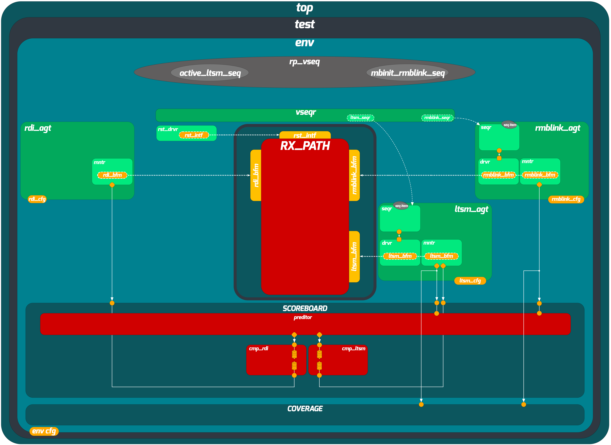

# RX-Path Block-Level UVM Verification Environment

## Overview

The RX-Path is the receive-side datapath of the UCIe PHY (Physical Layer). Its role is to take raw high-speed serial data arriving from the physical link and convert it into a parallel, clock-aligned format that the rest of the chip can use. The main responsibilities of the RX-Path include:

- **Clock recovery and alignment**: Recovering the embedded clock from the incoming data stream and aligning it with the local clock domain.
- **Deserialization**: Converting the incoming serial bit stream into parallel data words.
- **Lane deskew**: Compensating for timing differences across multiple parallel data lanes so that all lanes are properly aligned before data is forwarded.
- **Training pattern handling**: Detecting and processing training patterns used during the link training phase to calibrate the receiver.
- **Data validation**: Verifying the integrity of received data using per-lane identifiers, valid signals, and LFSR (Linear Feedback Shift Register) pattern checks.

The RX-Path sits between the physical link interface on one side and the RDI (Raw Die-to-Die Interface) on the other. It is controlled by the LTSM Controller, which dictates when the RX-Path should be in training mode versus active data mode.

---

## Environment Architecture

The verification environment follows the standard UVM architecture with multiple agents, a scoreboard with separated predictor and comparators, a coverage collector, and an SVA checker interface.



---

## Directory Structure

```
rp_env/
├── doc/                              # Documentation and architecture diagrams
│   ├── RX_PATH_UVM_Structure.png
│   ├── UCIe_RX-Path_Verification_Plan.csv
│   └── spec/                         # Reference specification files
└── src/
    ├── bfms/                         # Bus Functional Models (interfaces)
    │   ├── rp_ltsm_bfm.sv           #   LTSM controller interface
    │   ├── rp_rdi_bfm.sv            #   RDI interface
    │   ├── rp_reset_intf.sv          #   Reset interface
    │   └── rp_rmblink_bfm.sv        #   Reverse Mainband Link interface
    ├── sim/                          # Simulation scripts
    └── tb/                           # Testbench source
        ├── agents/                   # UVM agents
        │   ├── rp_agent_base.svh     #   Base agent class
        │   ├── ltsmc_agent.svh
        │   ├── rdi_agent.svh
        │   └── rmblink_agent.svh
        ├── drivers/                  # UVM drivers
        │   ├── rp_driver_base.svh    #   Base driver class
        │   ├── ltsmc_driver.svh
        │   ├── rdi_driver.svh
        │   ├── reset_driver.svh
        │   └── rmblink_driver.svh
        ├── monitors/                 # UVM monitors
        │   ├── rp_monitor_base.svh   #   Base monitor class
        │   ├── ltsmc_monitor.svh
        │   ├── rdi_monitor.svh
        │   └── rmblink_monitor.svh
        ├── scoreboard/               # Scoreboard with predictor-comparator separation
        │   ├── rp_cmp_base.svh       #   Base comparator class
        │   ├── rp_cmp_ltsmc.svh
        │   ├── rp_cmp_rdi.svh
        │   ├── rp_pred.svh           #   RX-Path predictor
        │   └── rp_scoreboard.svh
        ├── sequence_items/           # Transaction definitions
        │   ├── ltsmc_seq_item.svh
        │   ├── rdi_seq_item.svh
        │   └── rmblink_seq_item.svh
        ├── sequencers/               # UVM sequencers
        ├── sequences/                # UVM sequences
        │   ├── rp_sequence_base.svh  #   Base sequence class
        │   ├── ltsmc_sequence.svh
        │   ├── rmblink_active_sequence.svh
        │   ├── rmblink_sanity_PerLaneID_sequence.svh
        │   ├── rmblink_sanity_clk_sequence.svh
        │   ├── rmblink_sanity_lfsr_sequence.svh
        │   └── rmblink_sanity_valid_sequence.svh
        ├── virtual_sequences/        # Virtual sequences
        │   ├── virtual_sequence_base.svh  # Base virtual sequence class
        │   ├── rp_active_vseq.svh
        │   ├── rp_clk_sanity_vseq.svh
        │   ├── rp_sanity_PerLaneID_vseq.svh
        │   ├── rp_sanity_all_vseq.svh
        │   ├── rp_sanity_lfsr_vseq.svh
        │   └── rp_vaild_sanity_vseq.svh
        ├── tests/                    # UVM tests
        │   ├── rp_test_base.svh      #   Base test class
        │   ├── rp_sanity_all_test.svh
        │   ├── rp_sanity_clk_test.svh
        │   ├── rp_sanity_lfsr_test.svh
        │   ├── rp_sanity_valid_test.svh
        │   ├── rp_sanity_PerLaneID_test.svh
        │   └── rp_active_test.svh
        ├── sv_unit_tests/            # Unit tests for environment components
        ├── sva_unit_tests/           # Unit tests for SVA properties
        ├── rp_sva.sv                 # SystemVerilog Assertions checker
        ├── rp_coverage_collector.svh # Functional coverage
        ├── rp_shared_pkg.sv          # Shared package (types, constants, utilities)
        ├── rp_pkg.sv                 # Environment package
        ├── rp_utils.svh              # Utility functions
        ├── env.svh                   # Environment class
        ├── env_config.svh            # Environment configuration
        ├── agent_config.svh          # Agent configuration
        ├── agent_typedefs.svh        # Agent type definitions
        ├── virtual_sequencer.svh     # Virtual sequencer
        └── top.sv                    # Testbench top module
```

---

## Base Class Hierarchy

Each category of UVM components in this environment extends from a dedicated base class. The base class handles the common functionality (interface retrieval, reset handling, phase management), while derived classes only implement the protocol-specific behavior. This approach reduces code duplication and simplifies adding new agents or test scenarios.

| Component Category | Base Class | Derived Classes |
|---|---|---|
| Agents | `rp_agent_base` | `ltsmc_agent`, `rdi_agent`, `rmblink_agent` |
| Drivers | `rp_driver_base` | `ltsmc_driver`, `rdi_driver`, `reset_driver`, `rmblink_driver` |
| Monitors | `rp_monitor_base` | `ltsmc_monitor`, `rdi_monitor`, `rmblink_monitor` |
| Comparators | `rp_cmp_base` | `rp_cmp_ltsmc`, `rp_cmp_rdi` |
| Sequences | `rp_sequence_base` | LTSM controller, rmblink sanity, active, LFSR, valid, clock, and per-lane-ID sequences |
| Virtual Sequences | `virtual_sequence_base` | `rp_active_vseq`, `rp_clk_sanity_vseq`, `rp_sanity_all_vseq`, `rp_sanity_lfsr_vseq`, `rp_vaild_sanity_vseq`, `rp_sanity_PerLaneID_vseq` |
| Tests | `rp_test_base` | `rp_sanity_all_test`, `rp_sanity_clk_test`, `rp_sanity_lfsr_test`, `rp_sanity_valid_test`, `rp_sanity_PerLaneID_test`, `rp_active_test` |

---

## Predictor-Comparator Separation

The scoreboard follows the predictor-comparator architecture described by Cummings et al. [1]:

- **Predictor** (`rp_pred`) subscribes to the input-side monitor (rmblink and LTSM controller monitors) and computes the expected RX-Path outputs based on a behavioral model. This model replicates the deserialization, clock alignment, and lane deskew logic to predict what the DUT should output on the RDI and LTSM controller interfaces.

- **Comparators** (`rp_cmp_base` and its derived classes `rp_cmp_ltsmc`, `rp_cmp_rdi`) receive both the predicted and actual transactions through TLM FIFOs. They handle timeout detection, item alignment, and detailed pass/fail reporting. On a mismatch, the comparator prints both the expected and actual transaction fields to simplify debugging.

This separation makes the prediction logic portable and easier to maintain independently from the comparison infrastructure.

---

## Reset Testing

The base test class (`rp_test_base`) implements the UVM phase-jumping reset methodology described by Hunter [2] to test reset recovery:

1. The `phase_ready_to_end` callback on `uvm_shutdown_phase` forces the simulation to jump back to `uvm_pre_reset_phase` and re-run the entire test flow. This is repeated a configurable number of times (default: 3 cycles), ensuring the DUT can cleanly reset and re-initialize across multiple consecutive resets.

2. The `main_phase` supports injecting a randomized active reset. A random delay is selected from a weighted distribution, and after that delay, the test jumps back to `uvm_pre_reset_phase`. This verifies that the DUT handles a reset arriving at an arbitrary point during operation.

3. The comparator base class (`rp_cmp_base`) flushes its internal FIFOs during `pre_reset_phase` to prevent stale transactions from the previous run causing false mismatches.

This mechanism ensures that both idle resets (reset between test runs) and active resets (reset during operation) are covered without needing dedicated reset-only tests.

---

## Test Descriptions

| Test | Description |
|---|---|
| `rp_sanity_all_test` | Comprehensive sanity test that exercises the full RX-Path receive flow with all training patterns and data types. |
| `rp_sanity_clk_test` | Focuses on clock recovery and alignment behavior by exercising clock-pattern-specific scenarios. |
| `rp_sanity_lfsr_test` | Sends LFSR-based training patterns and verifies the RX-Path correctly detects and locks onto the pattern. |
| `rp_sanity_valid_test` | Targets the valid-signal handshake mechanism to ensure data validity is correctly propagated. |
| `rp_sanity_PerLaneID_test` | Verifies per-lane identification by exercising lane-specific patterns across all parallel lanes. |
| `rp_active_test` | Exercises the active data transfer mode after training, verifying high-speed data reception. |

---

## Coverage

Functional coverage is collected by `rp_coverage_collector`, which subscribes to monitor analysis ports and samples covergroups for training patterns, data patterns, lane configurations, and protocol states. The environment achieved 100% functional coverage and 100% code coverage.

---

## References

[1] C. Cummings, "UVM Scoreboarding," SNUG 2013.

[2] A. Hunter, "UVM Resets," SNUG.
