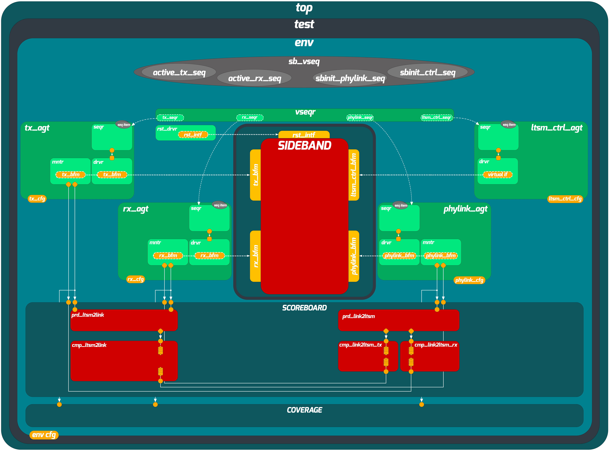

# Sideband Block-Level UVM Verification Environment

## Overview

The Sideband is a low-speed, serial communication channel within the UCIe PHY (Physical Layer). Its role is to exchange control and configuration messages between two connected dies before high-speed data transfer begins. It operates independently from the main high-speed data lanes and is responsible for:

- **Link initialization**: Performing a handshake sequence so both dies agree the physical link is operational.
- **Message exchange**: Serializing structured control messages (requests, responses, and data payloads) onto a single-bit serial link, and deserializing incoming messages from the other die.
- **Pattern generation and detection**: Transmitting and detecting a predefined clock and data pattern to verify link integrity during initialization.

Internally, the Sideband block consists of two main paths:

- **LTSM-to-Link (TX path)**: Receives a high-level message encoding from the Link Training State Machine (LTSM), converts it into a serialized bit stream, and drives it onto the physical link.
- **Link-to-LTSM (RX path)**: Captures incoming serial data from the physical link, deserializes it into a structured message, and forwards the decoded result back to the LTSM.

---

## Environment Architecture

The verification environment follows the standard UVM architecture with multiple agents, a scoreboard with separated predictors and comparators, a coverage collector, and an SVA checker interface.



---

## Directory Structure

```
sb_env/
├── doc/                              # Documentation and architecture diagrams
│   ├── Sideband_UVM_Structure.png
│   ├── Sideband_Environment_Documentation.pdf
│   ├── Sideband_Environment_Documentation.tex
│   ├── Sideband_SpecFile.pdf
│   └── Sideband_Verification_Plan.xlsx
└── src/
    ├── bfms/                         # Bus Functional Models (interfaces)
    │   ├── sb_ltsm_ctrl_bfm.sv       #   LTSM control interface
    │   ├── sb_phylink_bfm.sv         #   Physical link interface
    │   ├── sb_rdi_bfm.sv             #   RDI (Raw D-PHY Interface)
    │   ├── sb_reset_intf.sv          #   Reset interface
    │   ├── sb_rx_bfm.sv              #   RX path interface
    │   └── sb_tx_bfm.sv              #   TX path interface
    ├── sim/                          # Simulation scripts
    └── tb/                           # Testbench source
        ├── agents/                   # UVM agents
        │   ├── agent_base.svh        #   Base agent class
        │   ├── ltsm_ctrl_agent.svh
        │   ├── phylink_agent.svh
        │   ├── rx_agent.svh
        │   └── tx_agent.svh
        ├── drivers/                  # UVM drivers
        │   ├── sb_driver_base.svh    #   Base driver class
        │   ├── ltsm_ctrl_driver.svh
        │   ├── phylink_driver.svh
        │   ├── reset_driver.svh
        │   ├── rx_driver.svh
        │   └── tx_driver.svh
        ├── monitors/                 # UVM monitors
        │   ├── sb_monitor_base.svh   #   Base monitor class
        │   ├── phylink_monitor.svh
        │   ├── rx_monitor.svh
        │   └── tx_monitor.svh
        ├── scoreboard/               # Scoreboard with predictor-comparator separation
        │   ├── sb_cmp_base.svh       #   Base comparator class
        │   ├── sb_cmp_link2ltsm_rdi.svh
        │   ├── sb_cmp_link2ltsm_rx.svh
        │   ├── sb_cmp_link2ltsm_tx.svh
        │   ├── sb_cmp_ltsm2link.svh
        │   ├── sb_pred_link2ltsm.svh #   Link-to-LTSM predictor
        │   ├── sb_pred_ltsm2link.svh #   LTSM-to-Link predictor
        │   └── sb_scoreboard.svh
        ├── sequence_items/           # Transaction definitions
        │   ├── ltsm_ctrl_seq_item.svh
        │   ├── ltsm_seq_item.svh
        │   ├── phylink_seq_item.svh
        │   └── rdi_seq_item.svh
        ├── sequencers/               # UVM sequencers
        ├── sequences/                # UVM sequences
        │   ├── sb_sequence_base.svh  #   Base sequence class
        │   ├── sanity_sequences/
        │   ├── sendall_sequences/
        │   ├── rand_sequences/
        │   └── conc_sequences/
        ├── virtual_sequences/        # Virtual sequences
        │   ├── virtual_sequence_base.svh  # Base virtual sequence class
        │   ├── sb_sanity_vseq.svh
        │   ├── sb_sendall_vseq.svh
        │   ├── sb_rand_vseq.svh
        │   └── sb_conc_vseq.svh
        ├── tests/                    # UVM tests
        │   ├── sb_test_base.svh      #   Base test class
        │   ├── sb_sanity_test.svh
        │   ├── sb_sendall_test.svh
        │   ├── sb_rand_test.svh
        │   └── sb_conc_test.svh
        ├── sva_unit_tests/           # Unit tests for SVA properties
        ├── unit_tests/               # Unit tests for environment components
        ├── sb_sva.sv                 # SystemVerilog Assertions checker
        ├── sb_coverage_collector.svh # Functional coverage
        ├── sb_shared_pkg.sv          # Shared package (types, constants, utilities)
        ├── sb_pkg.sv                 # Environment package
        ├── sb_utils.svh              # Utility functions
        ├── env.svh                   # Environment class
        ├── env_config.svh            # Environment configuration
        ├── agent_config.svh          # Agent configuration
        ├── agent_typedefs.svh        # Agent type definitions
        ├── virtual_sequencer.svh     # Virtual sequencer
        └── top.sv                    # Testbench top module
```

---

## Base Class Hierarchy

A key design decision in this environment is the use of a base class for each category of UVM components. Each base class centralizes the shared logic, reducing duplication and making the environment easier to maintain and extend.

| Component Category | Base Class | Derived Classes |
|---|---|---|
| Agents | `agent_base` | `ltsm_ctrl_agent`, `phylink_agent`, `rx_agent`, `tx_agent` |
| Drivers | `sb_driver_base` | `ltsm_ctrl_driver`, `phylink_driver`, `reset_driver`, `rx_driver`, `tx_driver` |
| Monitors | `sb_monitor_base` | `phylink_monitor`, `rx_monitor`, `tx_monitor` |
| Comparators | `sb_cmp_base` | `sb_cmp_link2ltsm_rdi`, `sb_cmp_link2ltsm_rx`, `sb_cmp_link2ltsm_tx`, `sb_cmp_ltsm2link` |
| Sequences | `sb_sequence_base` | Sanity, sendall, random, and concurrent sequences |
| Virtual Sequences | `virtual_sequence_base` | `sb_sanity_vseq`, `sb_sendall_vseq`, `sb_rand_vseq`, `sb_conc_vseq` |
| Tests | `sb_test_base` | `sb_sanity_test`, `sb_sendall_test`, `sb_rand_test`, `sb_conc_test` |

For example, `sb_driver_base` handles the common interface retrieval and reset-aware run phase logic. Each derived driver only needs to implement the protocol-specific driving behavior.

---

## Predictor-Comparator Separation

The scoreboard follows the predictor-comparator architecture described by Cummings et al. [1], using a clean separation between prediction and comparison:

- **Predictors** (`sb_pred_ltsm2link`, `sb_pred_link2ltsm`) subscribe to the monitor outputs via TLM analysis ports and compute the expected DUT output based on a behavioral model of the Sideband. This includes message encoding/decoding, serialization/deserialization, and handshake protocol modeling.

- **Comparators** (`sb_cmp_base` and its derived classes) receive both the predicted and actual transactions through TLM FIFOs. They align expected and actual items, apply a configurable timeout, and report pass/fail results with detailed transaction dumps on mismatch.

This separation keeps the prediction logic independent from the comparison infrastructure, making each part easier to debug and reuse. The predictors are also reused at the system level (see `UCIE_top_env`) where they are instantiated inside the virtual sequencer to model the behavior of the remote die.

---

## SystemVerilog Assertions (SVA)

The file `src/tb/sb_sva.sv` implements an SVA checker interface that is bound to the DUT. It contains concurrent assertions that verify the Sideband's initialization behavior at the signal level, independently from the UVM scoreboard. The assertions cover:

| Assertion | What It Checks |
|---|---|
| `ap_pat_gen` | The TX data line produces the correct initialization pattern after `sb_init_start` is asserted. |
| `ap_pat_low` | The TX data line stays low during the idle (odd) millisecond intervals. |
| `ap_clk_gen` | The TX clock line produces the correct toggling pattern during initialization. |
| `ap_clk_low` | The TX clock line stays low during the idle (odd) millisecond intervals. |
| `chk_async_reset` | All outputs are driven to zero when the asynchronous reset is active. |
| `chk_no_clk_glitch` | No zero-time glitches occur on the TX clock output. |

Each assertion includes a `uvm_error` action block on failure, ensuring that assertion violations are reported through the standard UVM reporting mechanism and are reflected in the test pass/fail status.

Helper sequences (`q_clk_tgl`, `q_clk_low`, `q_clk_gen`, `q_pat_gen`, `q_pat_det`) are defined in a separate package (`sb_seq_pkg`) to keep the property definitions concise and readable.

---

## Reset Testing

The base test class (`sb_test_base`) implements the UVM phase-jumping reset methodology described by Hunter [2] to verify correct DUT behavior under reset conditions. The mechanism works as follows:

1. During the `main_phase`, after the primary test sequence completes, the test randomizes a delay and then jumps back to `uvm_pre_reset_phase`. This simulates an active reset — a reset that hits the DUT while it is in the middle of normal operation.

2. The `phase_ready_to_end` callback on the `uvm_shutdown_phase` enforces that the full reset-and-rerun cycle executes at least twice, ensuring the DUT can recover from reset and resume correct operation.

3. The comparator base class (`sb_cmp_base`) flushes its internal TLM FIFOs in `pre_reset_phase` to discard stale transactions from the previous run, preventing false mismatches after the phase jump.

This approach verifies that the DUT correctly resets all internal state and can re-initialize cleanly, without requiring separate reset-specific tests.

---

## Test Descriptions

| Test | Description |
|---|---|
| `sb_sanity_test` | Sends a single known message through the Sideband initialization and message exchange flow. Verifies basic end-to-end functionality. |
| `sb_sendall_test` | Iterates through all possible message encodings and sends each one, verifying that every supported message type is correctly serialized and deserialized. |
| `sb_rand_test` | Uses constrained-random stimulus to generate randomized message sequences with varying encodings, payloads, and timing. |
| `sb_conc_test` | Exercises concurrent TX and RX message traffic to verify that the Sideband handles simultaneous bidirectional communication correctly. |

---

## Coverage

Functional coverage is collected by `sb_coverage_collector`, which subscribes to monitor analysis ports and samples covergroups for message encodings, handshake sequences, and protocol states. The environment achieved 100% functional coverage and 100% code coverage.

---

## References

[1] C. Cummings, "UVM Scoreboarding," SNUG 2013.

[2] A. Hunter, "UVM Resets," SNUG.
